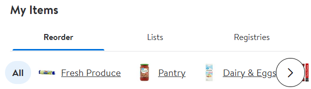
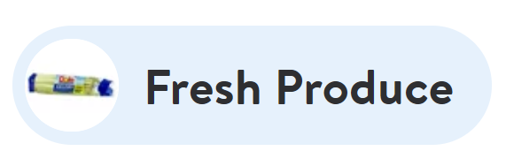

# Category personalization

<time datetime="{{ date | dateIso }}">{{ date | dateReadable }}</time>

The Walmart website (and app) recently added a small touch of personalization. The site has a section to reorder items that you've previously purchased ("My Items"). The section header includes a horizontal scroll of grocery categories: Fresh Produce, Pantry, Meat & Seafood, and so on. 

An image is associated with each category name. The interesting part is that each image matches an item the customer has actually purchased before.

<figure>

<figcaption>In this case, celery.</figcaption>
</figure>

## What purpose could a customized product label serve?

I'm conjecturing, but I would imagine the personalized image is there to make it easier and faster for users to find products. A customer will spend more money on items they're actually able to find. It may reduce the time it takes make a purchase, resulting in a more efficient shopping experience. 

## Pros and cons

What are the advantages of this feature? First, the user's memory is activated. Compared to a generic icon, an item you already know and love could create a stronger association to the category. Additionally, the image is a reminder of something you may want to buy during your current session.

From my perspective, the primary disadvantage of the feature is the tiny image size - it's only 30 x 30 pixels. The small size is necessary to keep the image proportionate to the text and maximize the limited horizontal space. However, for anyone with limited vision, the image could very well appear as a blur. As someone without vision issues, it's already quite difficult to see.

This is a fairly trivial example, but it does point to some novel uses of personalization. It makes me wonder how product labels, descriptions, and images could be customized as well.  It'll be interesting to see how personalization is further incorporated into products.