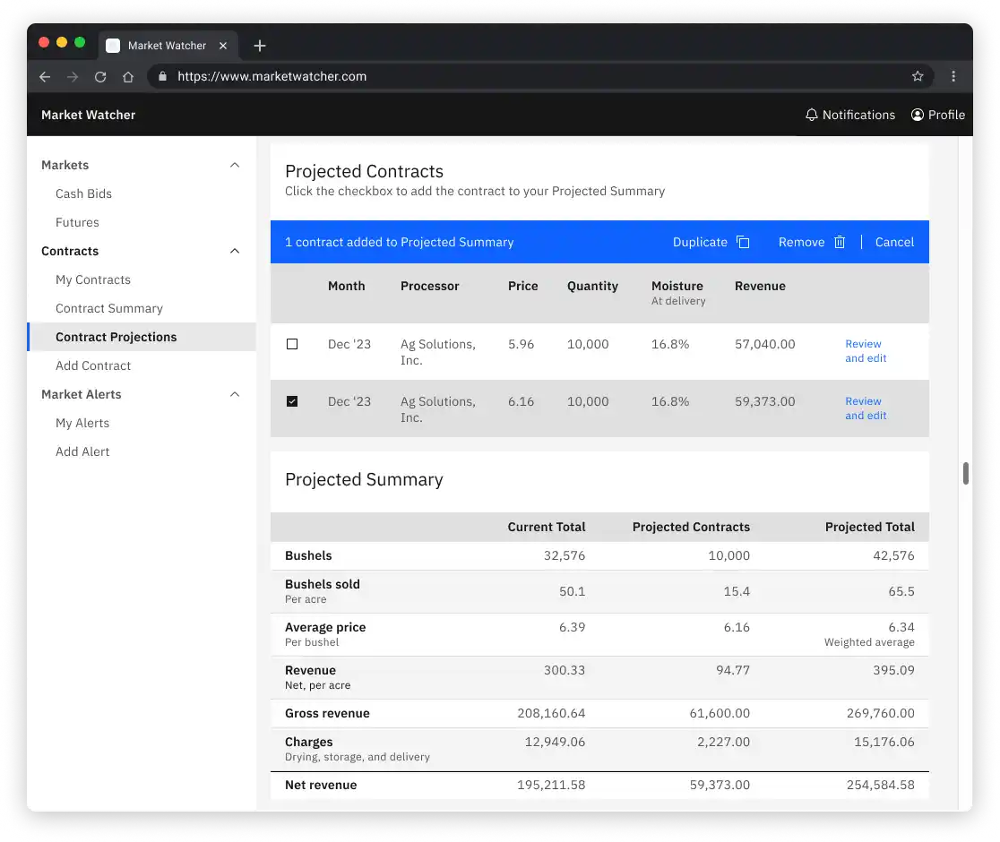

# Market Watcher: Implementing a workflow to help grain farmers improve market decisions and increase profits

## Overview

<!-- 
>>>>>  gd2md-html alert: inline image link here (to images/image1.png). Store image on your image server and adjust path/filename/extension if necessary.  (<a href="#">Back to top</a>)(<a href="#gdcalert2">Next alert</a>) >>>>> 
 -->

### Project context

Independently completed as a part of the UX Research and Design Specialization from the University of Michigan

### Featured activities and deliverables

* User interviews
* UX design
* UI design
* User flows

### Summary

Grain farmers must consider many factors when deciding to sell their crops on contract. Through my research, I uncovered these factors and examined them from a business and usability perspective. While walking through the user flow, I illustrate how Market Watcher assists in evaluating a potential sale by surfacing necessary information and reducing points of friction.

### Solution

I designed features for grain farmers to track market prices and evaluate potential revenue outcomes. To address usability constraints, I reduced the need for data entry by persisting state between views in the user flow.

## Business problem: selling grain in an unstable market

Each year, grain farmers must **sell their crops to local processors** at the highest possible price. That’s a challenge, because the** commodities markets are volatile**. 

Farmers** use market strategies to reduce the risk** that a season’s revenue won’t cover the cost of growing. 

These strategies include:

* Selling crops before harvest when prices are high 
* Using hedging strategies by trading derivatives in the national commodities market

The **decision to commit to a sales contract is a critical moment** of the growing season. A single trade could gain (or cost) a farm thousands of dollars in revenue.

## The process of making market decisions is both urgent and complex

During an interview, a grain farmer told a story that illustrates the difficulties inherent in choosing to commit to a contract.

While on the road for his second job, he heard on the radio that corn prices had risen - a lot. He wanted to sell his crop ahead of time on a **forward contract** to lock in a price.

Market opportunities vanish quickly. But to make a final decision, he needed to review the farm's financial metrics for the season.

<!-- 
>>>>>  gd2md-html alert: inline image link here (to images/image2.jpg). Store image on your image server and adjust path/filename/extension if necessary.  (<a href="#">Back to top</a>)(<a href="#gdcalert3">Next alert</a>) >>>>> 
 -->

<!--  -->

He had no choice but to:

1. Pull his truck over to the side of the road
2. Set up a mobile hotspot through his phone
3. Connect his laptop to the mobile hotspot
4. Go online to access the spreadsheet with his financial records
5. Enter the current corn price into the spreadsheet
6. Evaluate the data to make a decision about signing a contract for the current price
7. Call the grain buyer at his local processor to sell

Even in less-than-ideal circumstances, this process could be simplified through technology.

<!-- <callout> -->

If it was easier to access and analyze market information, grain farmers could increase their profits by making more informed and timely decisions.

<!-- </callout> -->

## Features to help grain farmers evaluate a potential sales contract

Making the decision to commit to a sales contract can be broken down into two overarching steps: monitoring market prices and reviewing contract data. To address these needs, I developed the following features:

* Views of current market prices
* An alert system to send notifications about changes in grain prices
* A way to save sales contracts and view overall revenue statistics for the season
* A spreadsheet-like interface to compare how changing contract prices and related expenses would affect overall revenue

<!-- 
>>>>>  gd2md-html alert: inline image link here (to images/image3.png). Store image on your image server and adjust path/filename/extension if necessary.  (<a href="#">Back to top</a>)(<a href="#gdcalert4">Next alert</a>) >>>>> 
 -->

<!--  -->

## Reducing friction for farmers with beginner-level computer skills

Farmers are not likely to encounter “typical” interfaces during their daily work. In interviews, the participants had little confidence in their technical abilities. Additionally, the median age of U.S. farmers is significantly higher than that of the general population. Between these facts, it was necessary to design for a target user with beginner-level computer skills.

Since this user base is **familiar with a complex domain but limited in technical experience**, I had to **balance competing needs for powerful functionality and a simple interface**.

Given these constraints, I wanted my design to:

1. Limit required data entry
2. Favor redundancy and explicitness over brevity
3. Make transitions as effortless as possible

## The user flow: Evaluating prospective sales contracts

### Creating the user flow

While I could have jumped straight into designing the interface, I wrote out the user flow to:

* Articulate how a task required moving across multiple sections of the interface
* Facilitate smooth transitions by noting likely navigation paths
* Map out what application state could be transferred between contexts

### Stepping through the user flow

This flow follows one of my personas, the Forward Contractor, as he considers whether or not to sell a portion of his grain. The flow assumes that the Forward Contractor has set up the following market alert:

Price movement: Notify me when Dec. ‘23 corn goes up by at least 10 cents (in one business day) at Ag Solutions, Inc. in Melville
    
<!-- 
>>>>>  gd2md-html alert: inline image link here (to images/image4.png). Store image on your image server and adjust path/filename/extension if necessary.  (<a href="#">Back to top</a>)(<a href="#gdcalert5">Next alert</a>) >>>>> 
 -->

<!--  -->
The steps of the flow are:

1. Receive notification
2. View contract information
3. Evaluate revenue metrics for the season
4. Evaluate revenue and costs for an individual contract

#### 1. Receive notification

The Forward Contractor receives a notification about a price alert.

<!-- 
>>>>>  gd2md-html alert: inline image link here (to images/image5.png). Store image on your image server and adjust path/filename/extension if necessary.  (<a href="#">Back to top</a>)(<a href="#gdcalert6">Next alert</a>) >>>>> 
 -->

<!--  -->
##### Features to note

1. **View contract**
    * Select to get more information on the contract.
2. **Sell now**
    * If the farmer is certain they’d like to sell, they can immediately call the grain buyer to lock in the price.

The Forward Contractor is interested in selling based on where the market is at, but wants to compare prices with other processors. He selects **View contract**.

#### 2. View contract information

In this view of cash bid (local) prices, the farmer can compare contract prices at nearby locations.

<!-- 
>>>>>  gd2md-html alert: inline image link here (to images/image6.png). Store image on your image server and adjust path/filename/extension if necessary.  (<a href="#">Back to top</a>)(<a href="#gdcalert7">Next alert</a>) >>>>> 
 -->

<!--  -->

##### Features to note

1. **Immediate relevant context**
    * The user is directed to the **expanded table row** with more information about the contract.
2. **Explicit sorting options**
    * The “Group by commodity” and “Group by location” sorting options are in a content switcher, simplifying sorting down to the most important options. 
3. **Favorites**
    * Farmers typically deliver their crops at the same time of year, so they’ll often seek out the same contract months. 
4. **Remove alert**
    * Toggles alert status, saving the alert for reference in case the user wants to reactivate it.
5. **Add to projections**
    * Adding the contract to projections allows the farmer to examine a deeper level of data before making a decision.

Before making a final decision, the Forward Contractor wants to see how this would affect his overall seasonal revenue and revenue per acre. To do this, he selects **Add to projections**

<!-- 
>>>>>  gd2md-html alert: inline image link here (to images/image7.gif). Store image on your image server and adjust path/filename/extension if necessary.  (<a href="#">Back to top</a>)(<a href="#gdcalert8">Next alert</a>) >>>>> 
 -->

<!--  -->

#### 3. Evaluate revenue metrics for the season

The Contract Projections view allows the Forward Contractor to **immediately see how the farm’s revenue metrics would change by selling at the current contract price**.

Adding the contract to the projected summary updates the statistics for all selected Projected Contracts and the Projected Total. This way, the Forward Contractor can view the **financial effect of committing to contracts at different prices**.

<!-- 
>>>>>  gd2md-html alert: inline image link here (to images/image8.png). Store image on your image server and adjust path/filename/extension if necessary.  (<a href="#">Back to top</a>)(<a href="#gdcalert9">Next alert</a>) >>>>> 
 -->

<!--  -->

##### Features to note

1. **Contract list**
    * Lists the saved potential contracts that can be added to the Projected Summary.
2. **Current total**
    * Statistics for all sales contracts that have been committed to and saved in the application.
3. **Projected contracts total**
    * When a potential contract is checked, it’s added to the Projected Summary. 
4. **Review and edit individual contract**
    * View or change details of the listed contract.

In this case, the Forward Contractor would see that selling 10,000 bushels at 6.16 brings down the total average price per bushel to 6.34. He would have committed to delivering 65.5 bushels per acre (roughly 30-40% of the expected total).

Finally, let’s say the Forward Contractor wants to see how costs would affect an individual contract and selects **Review and edit**.

#### 4. Evaluate revenue and costs for an individual contract

In this view, the Forward Contractor can edit processor charges to see how revenue changes for the selected contract.

<!-- 
>>>>>  gd2md-html alert: inline image link here (to images/image9.png). Store image on your image server and adjust path/filename/extension if necessary.  (<a href="#">Back to top</a>)(<a href="#gdcalert10">Next alert</a>) >>>>> 
 -->

<!--  -->

##### Features to note

1. **Net revenue**
    * As each input is edited, the net revenue, gross revenue, and charges are updated.
2. **Input**
    * Each input affects the section subtotal. In this case, moisture is an important variable to watch as it can vary significantly at harvest.
3. **Input toggle**
    * Not every grouping in the contract will be relevant, so they can be toggled on and off. For example, some farmers will have local processors transport grain, but many farmers handle delivery themselves.

<!-- 
>>>>>  gd2md-html alert: inline image link here (to images/image10.gif). Store image on your image server and adjust path/filename/extension if necessary.  (<a href="#">Back to top</a>)(<a href="#gdcalert11">Next alert</a>) >>>>> 
 -->

<!--  -->

In the end, the Forward Contractor decides to sell 10,000 bushels at the current price, accepting that this is an acceptable level of revenue for this portion of his harvest.

(animation of all four steps in process, labeled - optional)

## Conclusion

Market Watcher brings together each part of the decision-making process. Consolidating the data in one place makes it easier for grain farmers to analyze the decision. By transferring the information between contexts, the farmer is able to play around with revenue scenarios with ease.

If you’d like a closer look at my design, feel free to [take a look at the Figma file](https://www.figma.com/file/Tjw04NNIDyaZpHf6ITOOMC/Commodities-Application?node-id=222%3A134887).

[Email me](mailto:jaredjgebel@gmail.com) to connect or ask questions.

**Attributions**

Images

* Photo by[ Maxim Hopman](https://unsplash.com/@nampoh?utm_source=unsplash&utm_medium=referral&utm_content=creditCopyText) on[ Unsplash](https://unsplash.com/s/photos/stock-market?utm_source=unsplash&utm_medium=referral&utm_content=creditCopyText)
* Photo by [Tobi from Pexels](https://www.pexels.com/photo/man-wearing-black-denim-jacket-in-driver-s-seat-620332/)
* Photo by[ Chris Bair](https://unsplash.com/@chrisbair?utm_source=unsplash&utm_medium=referral&utm_content=creditCopyText) on[ Unsplash](https://unsplash.com/photos/kXe_mqOFAmM?utm_source=unsplash&utm_medium=referral&utm_content=creditCopyText)