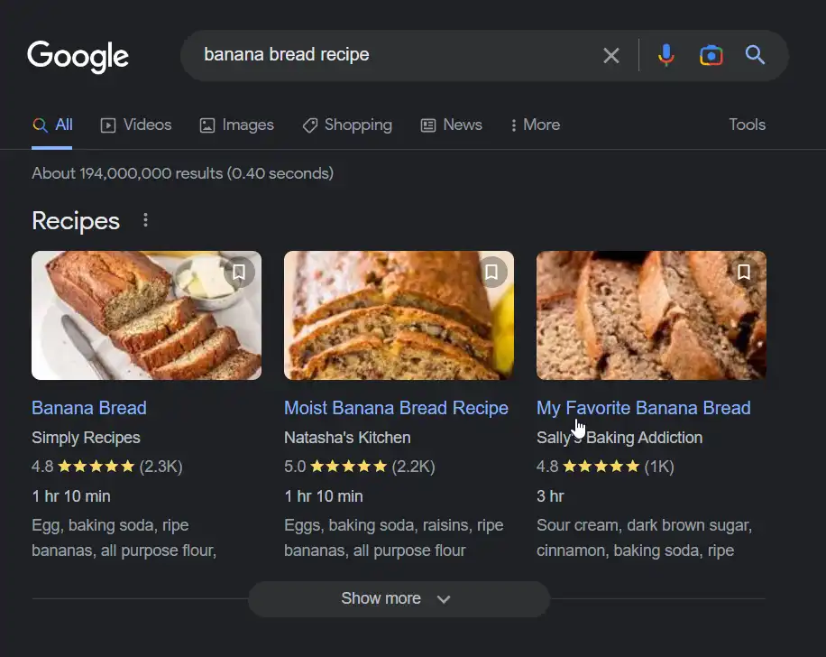
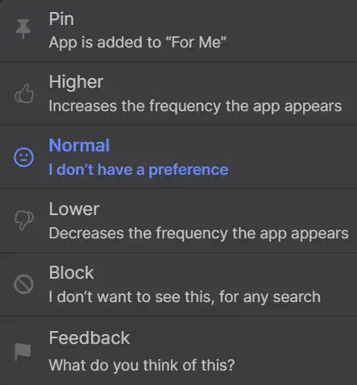

# Feature breakdown: You.com search engine _apps_

<time datetime="{{ date | dateIso }}">{{ date | dateReadable }}</time>

With the [recent news from Microsoft and Google](https://www.theguardian.com/technology/2023/feb/21/techscape-google-bard-microsoft-big-ai-search), the integration of AI into search engines has generated a lot of discussion. I recently discovered [You.com](you.com), a search engine startup with several AI-oriented products. Their flagship product is a **search engine for software developers**.

One thing that stood out to me was how additional functionality is integrated into the search results. In this post, I'll be describing You.com's _apps_ feature and thinking through some of the UX and product design implications.

## What exactly are _apps_ on You.com?

_Apps_ are components that can display search results or generate content directly in the results feed. At first, I thought the name _app_ referred to web apps, but **these _apps_ have separate functionality and have been built by the You.com team**.  

### Site structure

When first looking at the results feed, you'll notice that the list of results can be scrolled through on both vertical and horizontal axes.  At first glance, the horizontal list of cards appears to be quite similar to Google's featured links.  

<figure>

<figcaption>Google search results for query "banana bread recipe"</figcaption>
</figure>

<figure>

<figcaption>You.com search results for query "banana bread recipe"</figcaption>
</figure>

However, the You.com _apps_ have additional features, including:

### Website interactions from within the search feed

For some sites, you'll be able to view the most relevant content from the page within the search feed. Moreover, you can interact with the site from the _app_. For example, if you sign in to the Twitter _app_, you can follow, retweet, or favorite a tweet without leaving the search results page.

<figure>

<figcaption>Twitter <em>app</em>, embedded in search results</figcaption>
</figure>

_Apps_ aren't just for websites, though. There's also:

### AI widgets

AI interactions are available within the search feed, with features like code generation (YouCode), text generation (YouWrite), and an AI chatbot (YouChat).

### The ability to vote and pin

It's possible to express preferences for the _apps_ you'd like to see through upvotes, downvotes, pinning, or blocking. These preferences will personalize the search results that populate your feed. However, pinned _apps_ aren't always at the very top of the results.

<figure>

<figcaption>Menu for each <em>app</em></figcaption>
</figure>

_Apps_ won't show up if they're not relevant to your search. Thankfully, my "banana bread recipe" query didn't include results from Stack Overflow.

## _Apps_ from a user perspective

**A caveat for this section**   This isn't a criticism of the You.com product team. I'm not privy to all of the factors that affect business and product strategy decisions. However, all product features have pros and cons, and it's useful to consider what those might be as a **thought experiment**. {.warning-callout} 

Keeping in mind that the target audience for You.com is software developers, a few pros and cons for _apps_ come to mind.

### Pros for users

- **Speed**: It's faster to find information and access site features without having to actually click into the website.
- **Reduced context switching**: Workflow friction is lowered by combining complementary features into one feed.
- **Saved search preferences**: By pinning useful _apps_, users know their favorite sites will show up in the feed without effort.

### Cons for users

- **Complexity**: Streamlined tools like [Author](https://www.augmentedtext.info/author) have found popularity because of the way they reduce mental overhead. The You.com search engine is a different kind of tool, but some might not enjoy the way features are visually integrated.
- **_Apps_ have different functions**: As noted above, each item in an _app_ listing could include an interaction, an AI widget, or simply be a link. Users could end up with a muddled mental model of what exactly _apps_ are.
- **Potential inaccuracy of AI-based _apps_**: There are [many](https://www.cnn.com/2023/02/08/tech/google-ai-bard-demo-error/index.html) [examples](https://www.cnet.com/tech/services-and-software/search-engine-you-com-launches-chatgpt-style-chatbot) of AI chatbots giving out erroneous information, which erodes trust in the product.

## You.com _apps_ from a product perspective

Let's examine the pros and cons of the _app_ features from the perspective of product strategy as well.

### Pros for the product

- **Centrality**: A *lot* of functionality is included, increasing the likelihood that a user will stay on the site longer.
- **Appealing to target audience**: When the Stack Overflow and YouCode _apps_ are visibly embedded within search results, it's easy to see their utility.
- **Fresh and exciting**: It's been some time since search engines have seen true innovation, and _apps_ feel like a preview of what's coming.
- **Leaves the door open to add more functionality**: _Apps_ are currently based around websites or AI tools, but it's easy to envision more kinds of tools entering this space (something like a [Todoist](https://todoist.com/home) widget comes to mind).

### Cons for the product

- **Lots of development work required**: Since the You.com team is creating most of the _apps_ (so far), it has to be a lot of work to create and maintain _apps_ for so many websites, web applications, and AI-tools.
- **Lack of incentive for sites to develop their own _apps_**: By keeping the user in one central location, websites could take a hit in page views. Without additional incentives, I think they're unlikely to put effort into something that could harm their own business model.
- **Inertia**: One consequence of novelty is that people may be inclined to stick with something they better know and understand.

## Conclusion

I've used You.com and its _apps_ for help with coding, and I've found it to have utility for the use case of quickly finding answers to questions and generating snippets of code that clarify concepts.

The search engine is a staple of the internet, and changes to them have far-reaching implications. It's a risk for a product's value proposition to rely on novel forms of technology. While there's much debate about the role that AI will play in shaping the next generation of technology, there's no doubt we'll be hearing about it for a long time to come.
